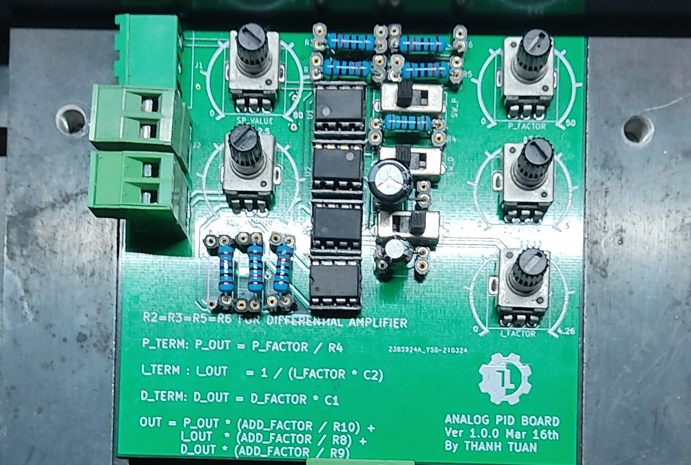

# Đề tài PID liên tục với Analog PID Board.
- Thay vì sử dụng vi xử lý/vi điều khiển và các vi mạch số rời mạch để thực hiệN thuật toán PID trong miền rờI rạc, ta hoàn toàn có thể hiện thực mô hình PID liên tục thông qua một linh kiện quen thuộc : OpAmp.
-  Đề tài này thực hiện mạch PID analog với việc sử dụng các mạch opamp cơ bản như cộng, khuếch đại vi sai, khuếch đại đảo, vi phân, tích phân,...

    Hình mạch Analog PID Board Ver 1.0.0.

- Toàn bộ đề tài được thực hiệN trên Kicad 5 và mô phỏng lý thuyết với Proteus.